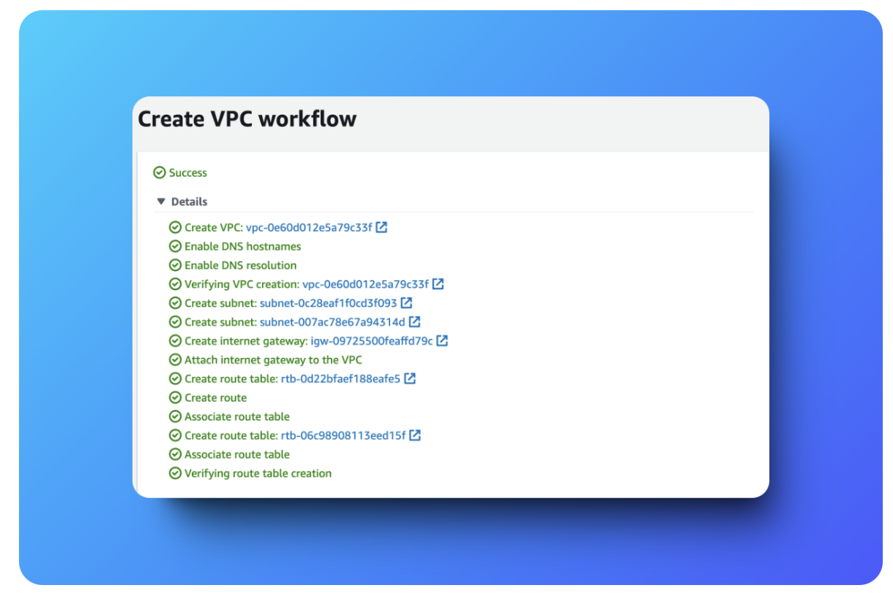
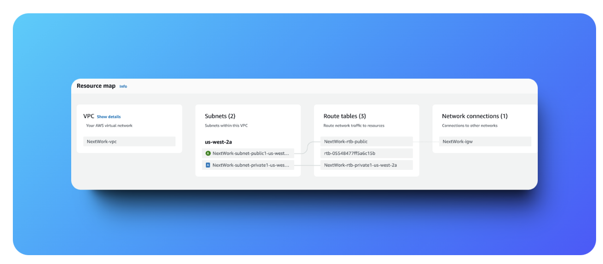
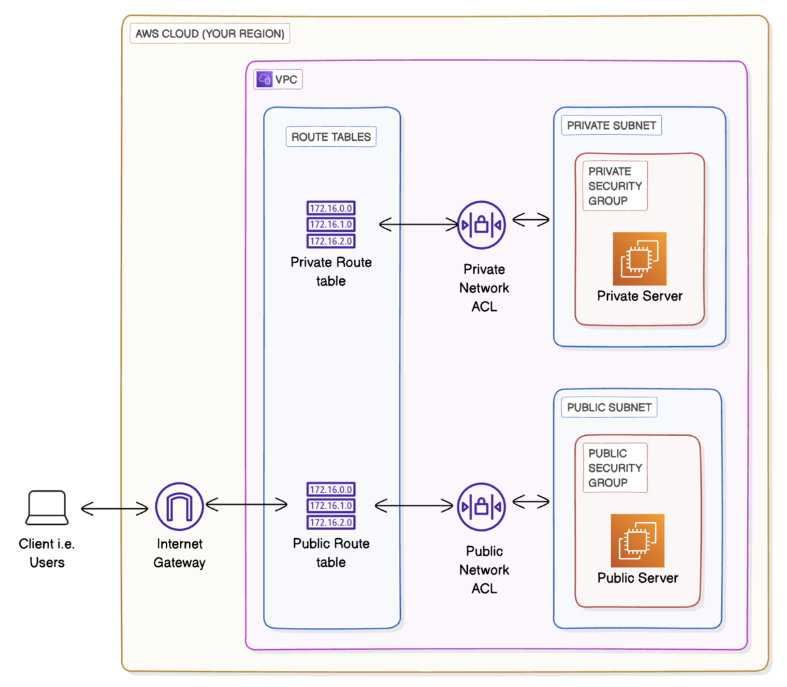
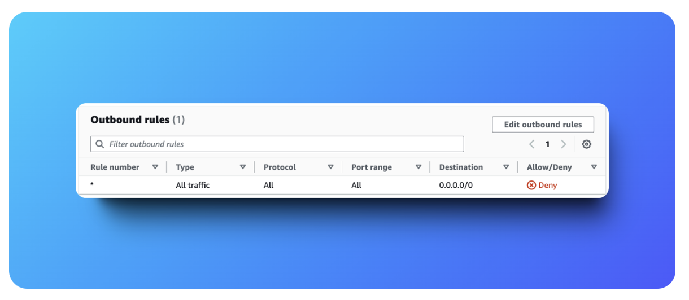
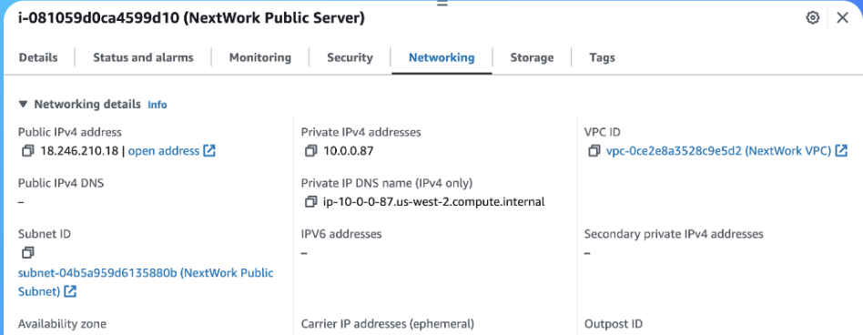
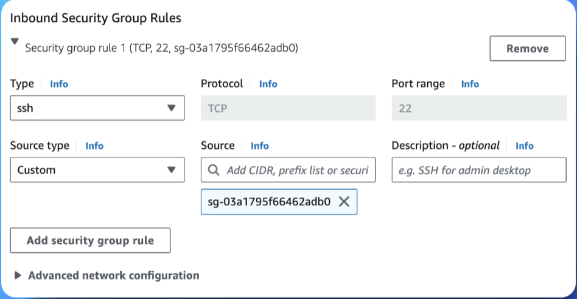
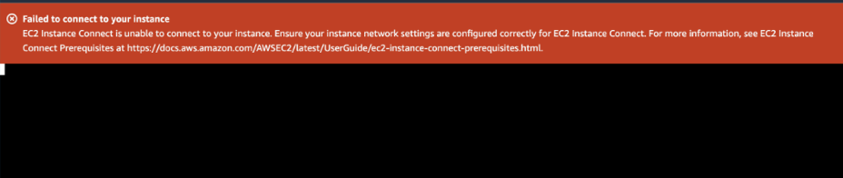
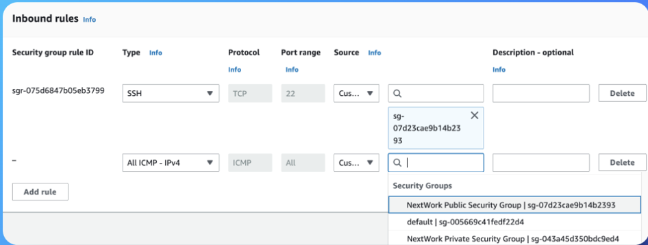
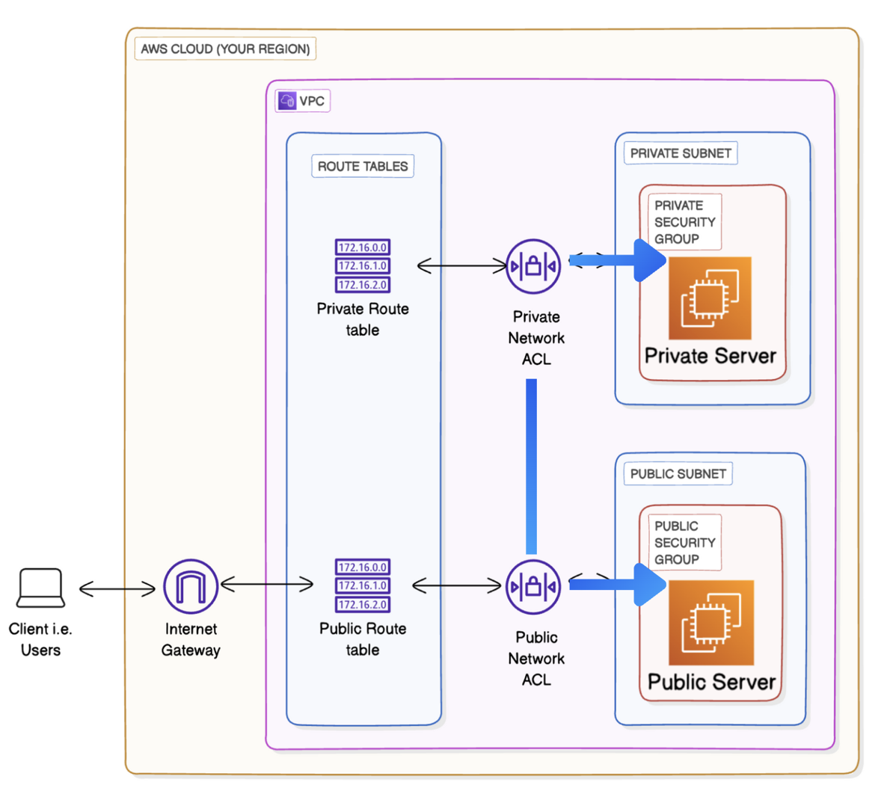

# AWS VPC Implementation Guide

This document provides detailed step-by-step instructions for implementing the AWS VPC connectivity project.

## Project Goal
The goal of this project was to set up a secure AWS VPC with both public and private subnets.
- Public server (EC2 instance in public subnet) should connect to the internet
- Private server (EC2 instance in private subnet) should not be exposed to the internet directly but should be accessible from the public server

## Step 1: Creating the VPC

### Configuration
1. Navigate to **VPC Console** → **Create VPC** → Choose **VPC and more**
2. Configure the following settings:
   - **IPv4 CIDR block**: `10.0.0.0/16`
   - **Tenancy**: Default
   - **Number of AZs**: 1
   - **Public subnet**: `10.0.0.0/24`
   - **Private subnet**: `10.0.1.0/24`
   - **NAT Gateway**: None (not needed for this project)
   - **DNS options**: Enabled



### 💡 Why This Configuration?
Splitting the network into public and private subnets allows for better security. Only the public subnet gets internet access through the Internet Gateway.





---

## Step 2: Setting Up Network ACLs

### Create Network ACLs
1. Create two separate NACLs:
   - **Public NACL** → Associate with public subnet
   - **Private NACL** → Associate with private subnet

### 💡 Why Network ACLs?
NACLs act as a stateless firewall at the subnet level, providing an additional layer of security.

**Configuration Details:**
- **Public NACL**: Allows inbound/outbound HTTP/HTTPS/SSH and ephemeral ports for internet traffic
- **Private NACL**: Allows internal communication but blocks direct internet access

---

## Step 3: Configuring Security Groups

### Public Security Group
**Inbound Rules:**
- HTTP (80) from Anywhere (0.0.0.0/0) - for web traffic
- SSH (22) from Anywhere-IPv4 (0.0.0.0/0) - for EC2 Instance Connect

**Outbound Rules:**
- Allow all traffic

### Private Security Group
**Inbound Rules:**
- SSH (22) from Public Security Group only
- ICMP (All) from Public Security Group (for ping tests)

**Outbound Rules:**
- Allow all traffic



### 💡 Why This Configuration?
Security groups are stateful and attached to EC2 instances. This setup:
- Allows public server to be accessed over HTTP and SSH
- Restricts private server access to only the public server
- Enables ping testing between servers

---

## Step 4: Launching EC2 Instances

### Public Server Configuration
- **AMI**: Amazon Linux 2023
- **Instance type**: t3.micro
- **Subnet**: Public subnet
- **Auto-assign Public IP**: Enabled
- **Security group**: Public Security Group



### Private Server Configuration
- **AMI**: Amazon Linux 2023
- **Instance type**: t2.micro
- **Subnet**: Private subnet
- **Auto-assign Public IP**: Disabled
- **Security group**: Private Security Group



---

## Step 5: Connecting to Public Server

### Initial Connection Attempt (Error)
Attempted to connect using **EC2 Instance Connect** → Connection failed



### Root Cause Analysis
**Issue**: Public Security Group didn't allow SSH traffic

### Solution
1. Navigate to Public Security Group
2. Add inbound rule:
   - **Type**: SSH
   - **Protocol**: TCP
   - **Port**: 22
   - **Source**: Anywhere-IPv4 (0.0.0.0/0)

### 💡 Why Anywhere-IPv4?
EC2 Instance Connect uses a wide range of IP addresses. For production environments, restrict this to known CIDR ranges or use AWS Systems Manager Session Manager for more secure access.

**✅ Result**: Successfully connected to public server after applying the fix.

---

## Step 6: Testing Public to Private Server Connectivity

### Initial Ping Test (Failed)
From public server, attempted to ping private server's IP (`10.0.1.x`) → **Failed**

### Troubleshooting Process

#### Issue 1: Network ACL Configuration
**Problem**: Private NACL had no ICMP rules

**Solution**: Added the following rules to Private NACL:
- **Inbound**: All ICMP - IPv4 from Public Subnet (10.0.0.0/24)
- **Outbound**: All ICMP - IPv4 to Public Subnet (10.0.0.0/24)

#### Issue 2: Security Group Configuration
**Problem**: Private Security Group had no ICMP rule

**Solution**: Added inbound rule to Private Security Group:
- **Type**: All ICMP - IPv4
- **Source**: Public Security Group



### 💡 Why Both NACLs and Security Groups?
- **NACLs are stateless**: Rules must be added in both directions
- **Security Groups are stateful**: Return traffic is automatically allowed
- **Defense in depth**: Multiple layers provide better security

**✅ Result**: Ping from public server to private server worked after both fixes.

---

## Step 7: Internet Connectivity Verification

### Public Server Internet Test
From public server terminal:
```bash
curl https://www.google.com
```
**✅ Result**: Successful response - confirmed internet access

### Private Server Internet Test
From private server terminal:
```bash
curl https://www.google.com
```
**❌ Result**: Failed (as expected) - confirmed no internet access

---

## Final Architecture Validation

### Connectivity Matrix
| From → To | Public Server | Private Server | Internet |
|-----------|---------------|----------------|----------|
| **Public Server** | ✅ Local | ✅ Private IP | ✅ IGW |
| **Private Server** | ✅ Private IP | ✅ Local | ❌ No Route |
| **Internet** | ✅ Public IP | ❌ No Access | N/A |

### Security Validation
- ✅ Public server accessible from internet (controlled access)
- ✅ Private server only accessible from public server
- ✅ Private server has no internet access
- ✅ Network segmentation properly implemented



---

## Next Steps

1. **Production Hardening**: Restrict SSH access to specific IP ranges
2. **Monitoring**: Set up CloudWatch for network monitoring
3. **Backup**: Consider automated backup strategies
4. **Scaling**: Plan for multi-AZ deployment if needed